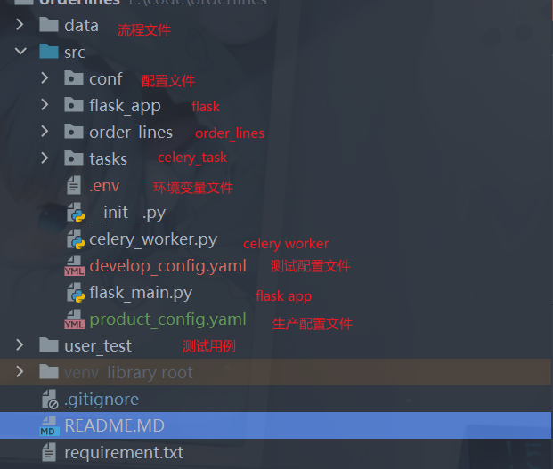
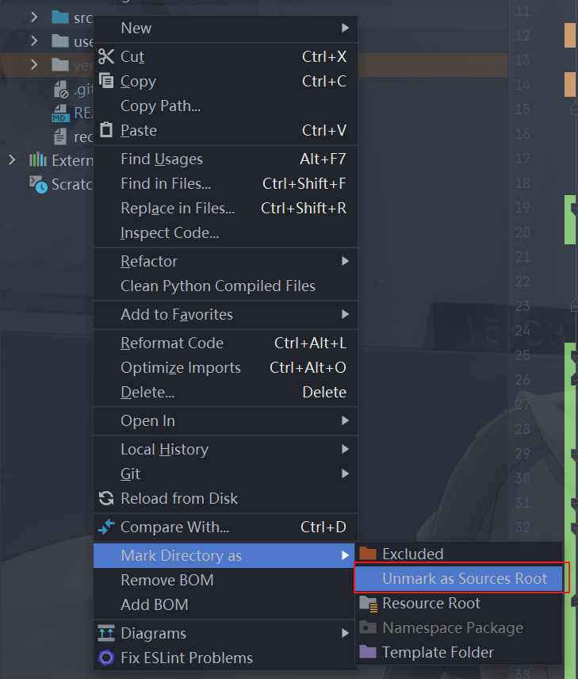
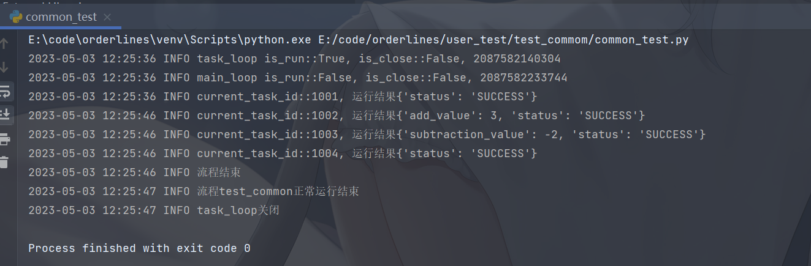

## 项目介绍

项目名称 orderlines

使用flask celery自主开发的一套工作流框架，现在为未完成状态 目前已实现功能

- 流程串行，基本功能
- 流程并行（可选择使用协程io密集型和进程cpu密集型）
- 任务返回值，返回值进行四则运算和变量拼接
- 流程控制， 根据任务运行状态和上个节点的返回值运行
- 任务超时，给定超时时间
- 定时任务，根据时间间隔，指定时间运行
- 异常处理策略，重试，忽略，抛错
- 任务回调，任务运行失败可以指定回调函数
- 任务停止

优化点

- api接口不完善，完善接口——进行时
- 添加命令行模式
- 支持大返回值使用mongodb或者redis进行存储
- 运行时增加变量，变量可以在流程中使用
- 增加grpc方式接口
- rbac权限，完善认证和权限控制——已完成
- 使用k8s进行运行定时任务和异步任务
- 增加前端界面
- docker 文件编写

### 模块简介

- 触发方式
    - 定时触发
    - 手动触发

- 流程运行
    - 流程构建
    - 流程解析
    - 流程运行
    - 流程日志
    - 流程运行报告

- 任务组件
    - 任务插件
    - 任务构建，任务解析
    - 异常策略
    - 流程网关。并行，任务组，流程控制
    - 任务返回值

- api接口，命令行模式
    - 权限管理
    - 流程增删改查
    - 流程操作。启动，停止，暂停，继续
    - grpc方式

### 设计思路

流程的使用链表进行串联

组件库就是我们具体要运行的任务，组件库中有基本的标准库，如start, end, process_control, parallel, group,common, 启动start, end作为内置built_in模块
common是支持我们自主进行编写的任务组件库，process_control, parallel作为网关控制我们任务的运行顺序，group作为抽象任务其中可以包含多个任务

celery在这里不是必须的，可以替换为k8s，celery只是作为流程运行的载体

### 组件库的设计思路

- 组件库实际上就是真正运行的任务
- 任务函数的参数必须增加**kw,因为流程运行中可能会有其他的参数
- 任务函数的返回值包含两个部分第一为运行状态，这里框架会自己处理，第二为自己的返回值，可以自定义
- 有返回值必须为dict字段方便扩展
- 组件库的初心是为了方便业务任务和流程框架的解耦，方便业务的扩展

**简单示例**

```python
import time

from orderlines.libraries.BaseTask import BaseTask, run_keyword_variant


class Test(BaseTask):

    @run_keyword_variant('Test')
    def test_add(self, a: int, b: int, **kwargs) -> dict:
        time.sleep(10)
        return {'add_value': a + b}

    @run_keyword_variant('Test')
    def test_subtraction(self, a: int, b: int, **kwargs) -> dict:
        return {'subtraction_value': a - b}

    @run_keyword_variant('Test')
    def test_multi(self, a: int, b: int, **kwargs) -> dict:
        return {'subtraction_value': a * b}
```

### 网关设计

目前已经实现的网关有三种。流程控制网关，并行网关，任务组。

- 流程控制网关。对于流程返回值的判断走任务A还是任务B 对于流程的运行状态进行判断，成功——任务A，失败——任务B

```text
模式1:对于流程返回值的判断走任务A还是任务B
模式2:对于流程的运行状态进行判断，成功——任务A，失败——任务B
```

- 并行网关。有两种模式`gevent`默认方式，使用协程的方式进行，适合网络io密集型，`process`使用进程方式运行适合计算密集型如pandas处理

```text
1、并行网关中运行的是任务组，就算只是运行一个任务也是一个任务组
2、并行网关可以使用两种方式来运行
    2.1 协程方式这种主要的运行方式就是使用协程的方式来运行，主要针对于io密集行数据
    2.2 进程方式这种是真正的并行，主要针对的是计算密集型
3、并行网关实际上也是一个任务集合的封装，其中只可以运行普通任务
4、并行任务有两种组合方式
    第一：声明式：并行任务中声明为任务组id，即parallel_task_ids中声明为任务组的id，这是在创建时就将任务组声明了
    第二：寻找式：并行任务中为所有的任务id,让框架自己寻找任务组，但是任务中必须要有pre_id和next_id
```

- 任务组。多个任务抽象为一个任务

```text
1、任务组中只可以运行普通任务，不可以运行流程控制，并发任务等任务
2、任务组是一个多个任务的集合，在主流程中只相当于一个普通节点
3、任务组是一个责任链模式，必须是确定的任务，任务组的中的子任务和其他方式的运行方式不一样
4、并发节点中只可以运行任务组就算是一个节点也要是一个任务组
5、任务组的group_ids是一个列表，包含着当前任务中的所有子任务
```

### 数据安全介绍

方式一、使用flask中`werkzeug.local.Local`进行线程隔离

方式二、使用队列进行流程运行时的取任务和放任务

方式三、数据表中的设计，使用uuid生成instance_id（运行时id）

### 目录结构介绍



## 使用方法

### 环境准备

- python3.7 以上，笔者使用python3.9
- mysql
- redis
- pycharm

### 基础配置

- src 目录设置为source root

  

- 修改配置文件
    - 本地测试。复制配置文件product_config.yaml为develop_config.yaml，修改.env
    - 正式环境需要修改环境变量

- 运行测试文件，出现以下输出，最好把所有的测试用例运行一遍，结果如下

  

### 流程文件配置介绍

```python
# 整个流程的配置是使用双向链表的形式
nodes = [
    # 每个流程必有的start和end节点
    {
        "task_id": 1000,  # 任务id唯一，应由前端生成
        "task_name": "start",  # 任务名称可以自定义 
        "task_module": "BuiltIn",  # 任务的组件库类名
        "method_name": "start",  # 对应组件库中的方法名称
        "task_type": "start",  # 流程类型分为start,common,process_control,parallel,group,end
        "method_kwargs": {},  # 任务运行需要的参数
        "prev_id": None,  # 任务的上一个节点的task_id
        "next_id": 1001,  # 任务的下一个节点的task_id
        "task_config": None,  # 任务的配置信息，如异常处理策略retry,ignore,raise，默认raise，超时时间timeout，回调方法默认send_email
        "desc": None  # 流程描述信息
    },
    {
        "task_id": 1001,
        "task_name": "并行网关",
        "method_name": "parallel_task",
        "task_type": "parallel",
        "method_kwargs": {
            "parallel_task_ids": [1002, 1005]
        },
        "prev_id": 1001,
        "next_id": 1007,
        "task_config": {
            'runner': 'gevent'  # 指定使用协程方式运行，默认参数，可以指定process
        },
        "task_module": "Parallel",
        "desc": None
    },
    {
        "task_id": 1002,
        "task_name": "任务组1",
        "method_name": "task_group",
        "task_type": "group",
        "method_kwargs": {
            "group_ids": [1003, 1004]
        },
        "task_config": None,
        "task_module": "Group",
        "desc": None
    },
    {
        "task_id": 1003,
        "task_name": "add1",
        "method_name": "test_add",
        "task_type": "common",
        "method_kwargs": {
            "a": 1,
            "b": 123143
        },
        "task_config": None,
        "task_module": "Test",
        "result": [  # 流程的返回值
            {
                "add_value": "${add_value}+1",  # 返回值使用${变量名}
                "variable_type": "int",  # 返回值类型 int, str， dict, list
                "variable_desc": "add函数的返回值"  # 返回值描述信息
            }
        ],
        "desc": None
    },
    {
        "task_id": 1004,
        "task_name": "subtraction1",
        "method_name": "test_subtraction",
        "task_type": "common",
        "method_kwargs": {  # 参数中使用变量
            "a": "${add_value}",
            "b": 123123
        },
        "task_config": None,
        "task_module": "Test",
        "result": [
            {
                "subtraction_value": "${return_value}",  # 使用变量用${变量名}
                "variable_type": "int",
                "variable_desc": "subtraction函数的返回值"
            }
        ],
        "desc": None
    },
    {
        "task_id": 1005,
        "task_name": "任务组2",
        "method_name": "task_group",
        "task_type": "group",
        "method_kwargs": {
            "group_ids": [1006]
        },
        "task_config": None,
        "task_module": "Group",
        "desc": None
    },
    {
        "task_id": 1006,
        "task_name": "减法",
        "method_name": "test_subtraction",
        "task_type": "common",
        "method_kwargs": {
            "a": 10,
            "b": 12
        },
        "task_config": None,
        "task_module": "Test",
        "desc": None
    },
    {
        "task_id": 1007,
        "task_name": "end",
        "method_name": "end",
        "task_type": "end",
        "method_kwargs": {},
        "prev_id": 1001,
        "next_id": None,
        "task_config": None,
        "task_module": "BuiltIn",
        "desc": None
    }
]
process_info = {
    'process_id': '1006',  # 流程id需要唯一
    'process_name': 'test_parallel_with_process',  # 流程名称自定义
    "creator": "blue",  # 流程创建者
    "updater": None,  # 流程更新者
    "process_config": {
        "timeout": 1  # 流程超时时间
    }
}
```

### 流程状态介绍

```python
import enum


class ProcessStatus(enum.Enum):
    green = 'SUCCESS'  # 流程成功
    red = 'FAILURE'  # 流程失败
    yellow = 'STOP'  # 流程停止
    grey = 'PENDING'  # 流程排队中
    blue = "RUNNING"  # 流程运行中


class StatusEnum(enum.Enum):
    grey = 'PENDING'  # 任务排队中
    blue = 'RUNNING'  # 任务运行中
    red = 'FAILURE'  # 任务失败
    green = 'SUCCESS'  # 任务成功
    pink = 'SKIP'  # 跳过任务
    yellow = 'STOP'  # 任务停止
    orange = 'RETRY'  # 任务重试中
```

其中task_status简单可以分为两种，PENDING，RUNNING，SUCCESS为成功，其他都为失败

### 启动celery worker

```shell
cd src
celery -A celery_worker.celery worker --loglevel=info --pool=solo
```

### 启动celery beat

```shell
cd src
celery -A celery_worker.celery beat -l info 
```

### 启动flask

- 启动flask flask_main.py
- 创建流程 http://127.0.0.1:5000/build/process POST 参数在 data/common_node.json
- 启动流程 `http://127.0.0.1:5000/orderlines_start` POST `{"process_id":"1001"}`

### 具体详细文档后续陆续更新
