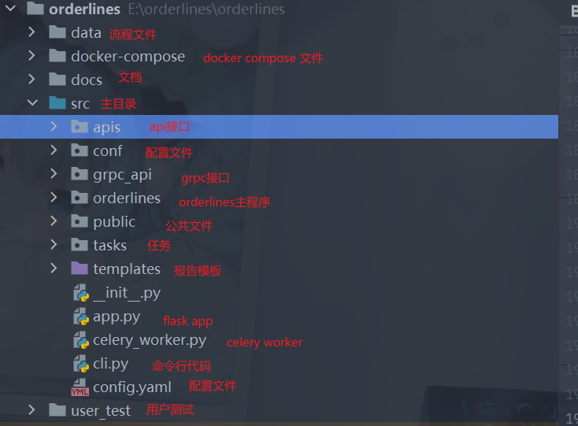
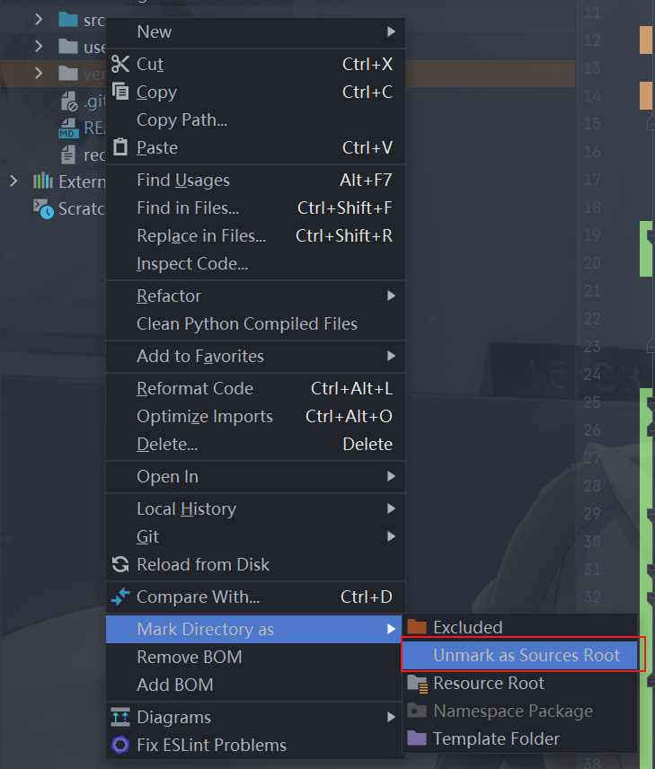

## 项目介绍

项目名称 orderlines

使用flask celery自主开发的一套工作流框架，目前已实现功能

- 流程串行，基本功能
- 流程并行（可选择使用协程io密集型和进程cpu密集型）
- 任务返回值，返回值进行四则运算和变量拼接
- 流程控制， 根据任务运行状态和上个节点的返回值运行
- 任务超时，给定超时时间
- 定时任务，根据时间间隔，指定时间运行
- 异常处理策略，重试，忽略，抛错
- 任务回调，任务运行失败可以指定回调函数
- 任务停止，支持有状态任务和无状态任务的停止
- 命令行模式，详情查看`orderlines --help`
- 支持大返回值使用mongodb或者redis进行存储
- 运行时增加变量 变量可以在流程中使用
- 增加grpc方式启动接口
- rbac权限，完善认证和权限控制，角色和群组两种模式
- 前端配置界面，详情请见`https://github.com/Y-aong/orderlines_front`
- docker-compose文件编写

### 模块简介

- 触发方式
    - 定时触发：定时触发，周期触发，间隔触发
    - 手动触发：直接运行

- 流程运行
    - 流程构建：根据json，yaml构建流程
    - 流程解析：解析任务，解析变量(参数)
    - 流程运行：流程并行，流程串行
    - 流程日志：实时运行日志推送
    - 流程运行报告：任务运行报告下载

- 任务插件
    - 任务插件，基础插件(开始节点，结束节点，延时节点，变量赋值，远程调用，执行python脚本)
    - 任务构建，任务解析
    - 异常策略：报错，忽略，重试
    - 流程网关：并行，任务组，流程控制，forEach(迭代器模式)
    - 任务返回值

- api接口，命令行模式
    - 权限管理
    - 流程增删改查
    - 流程操作。启动，停止，暂停，继续
    - grpc方式

### 设计思路

流程的使用链表进行串联

插件库就是我们具体要运行的任务，插件库中有基本的标准库，如start, end, process_control, parallel, group,common, 启动start, end作为内置built_in模块
common是支持我们自主进行编写的任务插件库，process_control, parallel作为网关控制我们任务的运行顺序，group作为抽象任务其中可以包含多个任务

celery在这里不是必须的，可以替换为k8s，celery只是作为流程运行的载体

### 插件库的设计思路

- 插件库实际上就是真正运行的任务
- 任务函数的参数必须增加**kw,因为流程运行中可能会有其他的参数
- 任务函数的返回值包含两个部分第一为运行状态，这里框架会自己处理，第二为自己的返回值，可以自定义
- 有返回值必须为dict字段方便扩展
- 插件库的初心是为了方便业务任务和流程框架的解耦，方便业务的扩展

**简单示例**

```python
import time

from pydantic import Field, BaseModel

from conf.config import OrderLinesConfig
from orderlines.libraries.BaseTask import BaseTask
from orderlines.utils.base_orderlines_type import BasePluginParam


class TestParam(BasePluginParam):
    a: int = Field(description='测试参数a')
    b: int = Field(description='测试参数b')


class AddResult(BaseModel):
    add_value: int = Field(description='相加的得到的值')


class SubtractionResult(BaseModel):
    subtraction_value: int = Field(description='相减的得到的值')


class MultiResult(BaseModel):
    multi_value: int = Field(description='相乘的得到的值')


class Test(BaseTask):
    version = OrderLinesConfig.version

    def __init__(self):
        super(Test, self).__init__()
        self.handle_param_method = ['test_add']
        self.handle_result_method = ['test_subtraction']
        self.handle_error_method = ['test_multi']

    def test_add(self, test_type: TestParam) -> AddResult:
        """加法测试"""
        time.sleep(1)
        return {'add_value': test_type.a + test_type.b}

    def test_subtraction(self, test_type: TestParam) -> SubtractionResult:
        """减法测试"""
        time.sleep(1)
        return {'subtraction_value': test_type.a - test_type.b}

    def test_multi(self, test_type: TestParam) -> MultiResult:
        """乘法测试"""
        time.sleep(1)
        return {'multi_value': test_type.a * test_type.b}

    def on_receive(self, param: BaseModel, task_name: str):
        add_param = param.model_dump()
        if task_name == 'test_add':
            add_param['a'] = add_param.get('a') + 1
            add_param['b'] = add_param.get('b') + 1
            return TestParam(**add_param)
        else:
            add_param['a'] = 12
            add_param['b'] = 13
            return TestParam(**add_param)

    def on_success(self, result: dict, task_name: str):
        if task_name == 'test_add':
            result['add_value'] = 108
            return result
        else:
            return result

    def on_failure(self, error: str, task_name: str):
        if task_name == 'test_add':
            return 'this is a add task error'
        else:
            return error
```

### 网关设计

目前已经实现的网关有三种。流程控制网关，并行网关，任务组。

- 流程控制网关。对于流程返回值的判断走任务A还是任务B 对于流程的运行状态进行判断，成功——任务A，失败——任务B

```text
模式1:对于流程返回值的判断走任务A还是任务B
模式2:对于流程的运行状态进行判断，成功——任务A，失败——任务B
```

- 并行网关。有两种模式`gevent`默认方式，使用协程的方式进行，适合网络io密集型，`process`使用进程方式运行适合计算密集型如pandas处理

```text
1、并行网关中运行的是任务组，就算只是运行一个任务也是一个任务组
2、并行网关可以使用两种方式来运行
    2.1 协程方式这种主要的运行方式就是使用协程的方式来运行，主要针对于io密集行数据
    2.2 进程方式这种是真正的并行，主要针对的是计算密集型
3、并行网关实际上也是一个任务集合的封装，其中只可以运行普通任务
4、并行任务有两种组合方式
    第一：声明式：并行任务中声明为任务组id，即parallel_task_ids中声明为任务组的id，这是在创建时就将任务组声明了
    第二：寻找式：并行任务中为所有的任务id,让框架自己寻找任务组，但是任务中必须要有pre_id和next_id
```

- 任务组。多个任务抽象为一个任务

```text
1、任务组中只可以运行普通任务，不可以运行流程控制，并发任务等任务
2、任务组是一个多个任务的集合，在主流程中只相当于一个普通节点
3、任务组是一个责任链模式，必须是确定的任务，任务组的中的子任务和其他方式的运行方式不一样
4、并发节点中只可以运行任务组就算是一个节点也要是一个任务组
5、任务组的group_ids是一个列表，包含着当前任务中的所有子任务
```

### 数据安全介绍

方式一、使用flask中`werkzeug.local.Local`进行线程隔离

方式二、使用队列进行流程运行时的取任务和放任务

方式三、数据表中的设计，使用uuid生成instance_id（运行时id）

### 目录结构介绍



## 使用方法

### 环境准备

- python3.7 以上，笔者使用python3.9
- mysql
- redis
- mongodb
- pycharm

### 基础配置

- src 目录设置为source root

  

- 修改配置文件
    - 修改配置文件中的数据库配置

### 流程文件配置介绍

```python
# 整个流程的配置是使用双向链表的形式
data = [
    {
        "task_id": "1001",
        "task_name": "start",
        "method_name": "start",
        "task_type": "start",
        "method_kwargs": {},
        "prev_id": None,
        "next_id": "1002",
        "task_config": None,
        "task_module": "BuiltIn",
        "module_version": "1.0.0.1",
        "desc": None
    },
    {
        "task_id": "1002",
        "task_name": "add",
        "method_name": "test_add",
        "task_type": "common",
        "method_kwargs": {
            "a": 1,
            "b": 123143
        },
        "prev_id": "1001",
        "next_id": "1003",
        "task_config": None,
        "task_module": "Test",
        "module_version": "1.0.0.1",
        "result_config":
            {
                "result_key": "add_value",
                "variable_key": "${add_result}",
            },
        "desc": None
    },
    {
        "task_id": "1003",
        "task_name": "subtraction",
        "method_name": "test_subtraction",
        "task_type": "common",
        "method_kwargs": {
            "a": "${add_result}",
            "b": 123123
        },
        "prev_id": "1002",
        "next_id": "1004",
        "task_config": None,
        "task_module": "Test",
        "module_version": "1.0.0.1",
        "result_config": [

        ],
        "desc": None
    },
    {
        "task_id": "1004",
        "task_name": "end",
        "method_name": "end",
        "task_type": "end",
        "method_kwargs": {},
        "prev_id": "1003",
        "next_id": None,
        "task_config": None,
        "task_module": "BuiltIn",
        "module_version": "1.0.0.1",
        "desc": None
    }
]

process_info = {
    "process_id": "1003",
    "process_name": "test_variable1",
    "creator": "blue",
}
variable = [
    {
        "variable_key": "add_result",
        "variable_type": "int",
        "variable_desc": "add函数的返回值"
    }
]
```

### 流程状态介绍

```python
import enum


class ProcessStatus(enum.Enum):
    green = 'SUCCESS'  # 流程成功
    red = 'FAILURE'  # 流程失败
    yellow = 'STOP'  # 流程停止
    grey = 'PENDING'  # 流程排队中
    blue = "RUNNING"  # 流程运行中


class StatusEnum(enum.Enum):
    grey = 'PENDING'  # 任务排队中
    blue = 'RUNNING'  # 任务运行中
    red = 'FAILURE'  # 任务失败
    green = 'SUCCESS'  # 任务成功
    pink = 'SKIP'  # 跳过任务
    yellow = 'STOP'  # 任务停止
    orange = 'RETRY'  # 任务重试中
```

其中task_status简单可以分为两种，PENDING，RUNNING，SUCCESS为成功，其他都为失败

### 启动方式

#### docker启动, 直接部署

```shell
bash deploy.sh
```

#### 命令行启动

```shell
# 先进行打包
pip install --editable .
# 查看帮助帮助
orderlines --help
# 启动命令
orderlines run-server # 启动flask服务
orderlines schedule # 启动定时器
celery -A celery_worker.celery worker --loglevel=info --pool=solo # 启动celery
```

### 测试启动

#### 启动celery worker

```shell
# 启动celery
cd src
celery -A celery_worker.celery worker --loglevel=info --pool=solo

# 启动flask
python src/app.py # 启动flask
```

### 具体详细文档后续陆续更新
